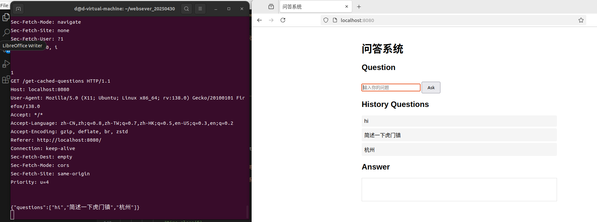
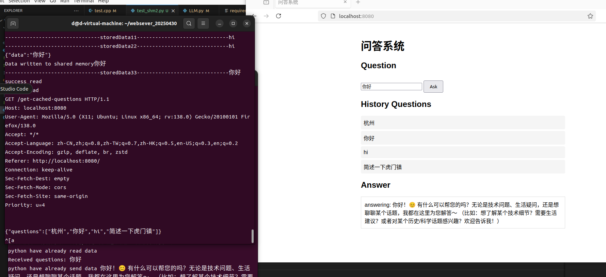
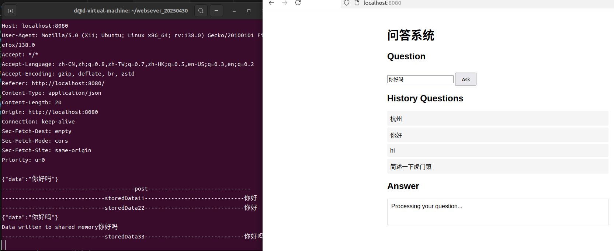

## 详细说明

###  1. 项目描述
- 本项目是一个c++的高性能websever，结合python基于langchain实现了一个LLM的知识库问答系统。（意思是比如，构建专门某个领域的向量知识库，结合LLM的文本生成能力实现回答）

- 框架主要写了个c++的http websever，里面包含手动实现的线程池，socket结合epoll多路复用的网络编程，从而实现http的请求和响应，同时也实现了读取静态html方法，get和post的请求方法（前端html写的比较简单）。对于前端输入的内容通过post进行请求响应，同时我在后续还增加了redis进行一些输入数据的缓存，如果存在redis缓存中，则直接响应回答，否则就会进行等待，然后去python进程进行处理。对于从前端拿到的数据（即用户输入的待解答的问题），我是用的共享内存结合信号量传递到python进程中进行处理。我的c++主要是写在test.cpp里，有点乱因为是一点点加的哈哈哈. 

- redis结合MD5作为key 设计为：“key = "qa:" + MD5(question) ， value = answer” 同时，参考了别的网站，有历史问题列表，将redis中的问题显示出来，可以直接查看。在输入问题发送post请求后，同时前端发送个"/get-cached-questions"路径的post请求，响应时会把redis的key取出来，同时我用一个unordered_map哈希表，存储MD5和对应的问题作为值，响应回来，在前端页面显示出来这些问题，当作历史的提问。如果想查看历史问题的话，点击历史问题，将会直接从redis缓存中取出答案。（如果实现高性能的话，还是得引入连接池）

- python层面 首先是构建好知识库，build_data.py中，用的是text2vec的分词模型，将你所需要的的知识内容准备好，存在本地的txt文件或者其他，修改“loader = TextLoader("DoubleHandRobot")”，基于langchain的chroma构建sqllite3向量库，并保存。我参照的是阿里云QWEN官网使用dashcope的例子进行api调用。LLM.py是我编写的回答问题的进程，通过c++sever那边获取过来的问题，设定好提示词，读取分词数据库进行回答，最后同时也是将结果通过另一共享内存返回回sever中，通过前端显示出来。（ps：如果报错的话可能需要充值以下，当然后续langchain也可能会更新，代码当然也需要响应更新）

### 2. 使用说明
- 准备好ubuntu22.04 python3.11 c++11 json huggingface中的text2vec模型  redis 。。。
- 去QWEN官网准备好阿里云和QWEN的api
- pip install -r requirements.txt
- bash ./build_run.sh
- bash ./http_sever && python3 LLM.py # 先启动sever，再打开另一终端运行LLM.py

### 3. 后续持续更新优化。。。 （可能考虑弄一下搜索引擎；加个mysql用户管理；优化一下代码结构；实现一些中间件之类等等等）
